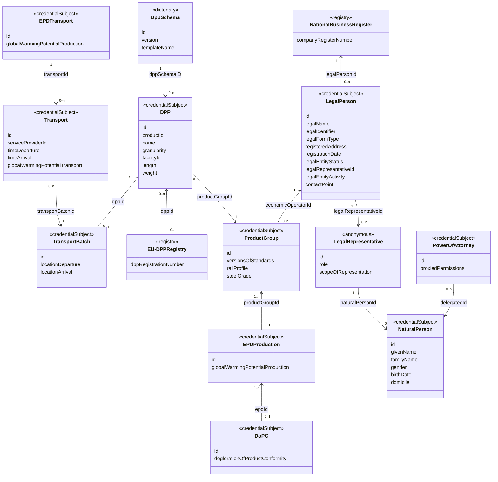

# Credential Vocabulary
# 5. Data Model

# Description data model
Note: Class descriptions are aligned to the DPP System Standard (link follows) semantic/functional model (data model, product property and information product structures, transactional timestamps, dictionary/units, stakeholders, and EU DPP Registry). Rail-specific acceptance/mechanical context for steel grades references EN 13674-1. Inline citations point to attached files and pages.

*Note: All classes receive per default an id provided by json ld context "@id". Therefore class id's are not listet in following vocabulary. 

## ProductGroup
Groups rail products that share essential technical characteristics (e.g., railProfile and steelGrade) so they can be managed and assessed consistently within a DPP. In the DPP System Standard (link follows) model, such characteristics are represented as product properties in a Product property collection; related certificates and documents are modeled as information products DPP System Standard (link follows). Steel grade-related acceptance and mechanical conformity are validated via tensile strength/elongation testing procedures (predictive equations, periodic tests, corrective actions) in EN 13674-1 (Schinene Norm EN 13674-1.pdf, 19).

### versionsOfStandards
List of standards and versions applied to define properties and documentation; aligns with the repository model where property templates are defined “in a standard” and units are controlled DPP System Standard (link follows).
| Key | Value |
|---|---|
| Term | versionsOfStandards |
| URL | https://github.com/railway-dpp/vocabulary?tab=readme-ov-file#versionsOfStandards |
| Expected Value | array of string |

### railProfile
Domain-specific product property identifying the rail profile; model as a single-valued product property in the Product property collection DPP System Standard (link follows).
| Key | Value |
|---|---|
| Term | railProfile |
| URL | https://github.com/railway-dpp/vocabulary?tab=readme-ov-file#railProfile |
| Expected Value | string (e.g., 60E1) |

### steelGrade
Domain-specific product property indicating the steel grade; mechanical conformity is validated by tensile strength/elongation testing per EN 13674-1 clause 8.7 (Schinene Norm EN 13674-1.pdf, 19). Represent as a single-valued product property DPP System Standard (link follows).
| Key | Value |
|---|---|
| Term | steelGrade |
| URL | https://github.com/railway-dpp/vocabulary?tab=readme-ov-file#steelGrade |
| Expected Value | string (e.g., R260, R350HT) |

## National Business Register
Represents a national registry where companies are identified by a companyRegisterNumber. Such identifiers support unambiguous identification of the authorized operator (“who”: legal entity responsible for a product-related event) in the transactional model DPP System Standard (link follows).

### companyRegisterNumber
Registered company number used to identify the LegalPerson/economic operator.
| Key | Value |
|---|---|
| Term | companyRegisterNumber |
| URL | https://github.com/railway-dpp/vocabulary?tab=readme-ov-file#companyRegisterNumber |
| Expected Value | string |

## Transport
Models a transport credential subject with the responsible provider and time-bound movement data. Times align with the transactional model’s Event time; shipping is a typical business step (CEN-CLC-JTC 24-WG 4_N911_DRAFT..., 16). Service provider is a stakeholder role in the DPP context DPP System Standard (link follows).

### serviceProviderId
Identifier of the service provider responsible for the transport (stakeholder role “service provider”) DPP System Standard (link follows).
| Key | Value |
|---|---|
| Term | serviceProviderId |
| URL | https://github.com/railway-dpp/vocabulary?tab=readme-ov-file#serviceProviderId |
| Expected Value | string |

### timeDeparture
Departure event time; corresponds to Event time in the transactional model DPP System Standard (link follows).
| Key | Value |
|---|---|
| Term | timeDeparture |
| URL | https://github.com/railway-dpp/vocabulary?tab=readme-ov-file#timeDeparture |
| Expected Value | string (ISO 8601 date-time) |

### timeArrival
Arrival event time; corresponds to Event time in the transactional model DPP System Standard (link follows).
| Key | Value |
|---|---|
| Term | timeArrival |
| URL | https://github.com/railway-dpp/vocabulary?tab=readme-ov-file#timeArrival |
| Expected Value | string (ISO 8601 date-time) |

### globalWarmingPotentialTransport
Environmental impact metric for the transport stage, represented as a product/transport property with controlled units (unit handling via repository model) DPP System Standard (link follows).
| Key | Value |
|---|---|
| Term | globalWarmingPotentialTransport |
| URL | https://github.com/railway-dpp/vocabulary?tab=readme-ov-file#globalWarmingPotentialTransport |
| Expected Value | number (e.g., kg CO2e) |

## TransportBatch
Represents a shipment batch aggregating one or more Transport records for a given DPP, capturing origin/destination to support traceability across movements (aligns with the data model’s identification pattern for data elements) DPP System Standard (link follows).

### locationDeparture
Departure location of the batch (address/coordinates) as a data element value DPP System Standard (link follows).
| Key | Value |
|---|---|
| Term | locationDeparture |
| URL | https://github.com/railway-dpp/vocabulary?tab=readme-ov-file#locationDeparture |
| Expected Value | string |

### locationArrival
Arrival location of the batch DPP System Standard (link follows).
| Key | Value |
|---|---|
| Term | locationArrival |
| URL | https://github.com/railway-dpp/vocabulary?tab=readme-ov-file#locationArrival |
| Expected Value | string |

## DPP
The Digital Product Passport is the digital container for relevant product data and properties. The DPP System Standard (link follows) data model enumerates core metadata: ID, Product_id, Product Name, Product type (granularity), etc. DPP System Standard (link follows). Product properties such as length and weight are expressed via data elements with units from controlled vocabularies per the repository model DPP System Standard (link follows).

### productId
Identifier of the product linked to the DPP DPP System Standard (link follows).
| Key | Value |
|---|---|
| Term | productId |
| URL | https://github.com/railway-dpp/vocabulary?tab=readme-ov-file#productId |
| Expected Value | string |

### name
Human-readable product/DPP name DPP System Standard (link follows).
| Key | Value |
|---|---|
| Term | name |
| URL | https://github.com/railway-dpp/vocabulary?tab=readme-ov-file#name |
| Expected Value | string |

### granularity
Scope of the DPP instance; corresponds to Product type values Model, Batch, Item DPP System Standard (link follows).
| Key | Value |
|---|---|
| Term | granularity |
| URL | https://github.com/railway-dpp/vocabulary?tab=readme-ov-file#granularity |
| Expected Value | enum (“model” | “batch” | “item”) |

### facilityId
Identifier of the production facility; modeled as a data element value DPP System Standard (link follows).
| Key | Value |
|---|---|
| Term | facilityId |
| URL | https://github.com/railway-dpp/vocabulary?tab=readme-ov-file#facilityId |
| Expected Value | string (e.g., GLN) |

### length
Product length; single-valued property with controlled unit mapping DPP System Standard (link follows).
| Key | Value |
|---|---|
| Term | length |
| URL | https://github.com/railway-dpp/vocabulary?tab=readme-ov-file#length |
| Expected Value | number (mm/m) |

### weight
Product weight; single-valued property with controlled unit mapping DPP System Standard (link follows).
| Key | Value |
|---|---|
| Term | weight |
| URL | https://github.com/railway-dpp/vocabulary?tab=readme-ov-file#weight |
| Expected Value | number (kg) |

## EU-DPP Registry
Represents the EU Digital Product Passport Registry, where DPPs are registered to support discovery, conformity, and market surveillance. Registration is called out as an interoperability-relevant moment and responsibility for economic operators DPP System Standard (link follows).

### dppRegistrationNumber
Registration identifier of the DPP in the EU DPP Registry DPP System Standard (link follows).
| Key | Value |
|---|---|
| Term | dppRegistrationNumber |
| URL | https://github.com/railway-dpp/vocabulary?tab=readme-ov-file#dppRegistrationNumber |
| Expected Value | string |

## DppSchema
Captures the schema/profile used by DPP instances. In the DPP System Standard (link follows) model, property templates, standards, and units reside in open data dictionary repositories that schemas reference DPP System Standard (link follows); data elements carry dictionary references DPP System Standard (link follows).

### version
Version of the schema.
| Key | Value |
|---|---|
| Term | version |
| URL | https://github.com/railway-dpp/vocabulary?tab=readme-ov-file#version |
| Expected Value | string |

### templateName
Human-readable template name/profile.
| Key | Value |
|---|---|
| Term | templateName |
| URL | https://github.com/railway-dpp/vocabulary?tab=readme-ov-file#templateName |
| Expected Value | string |

## DoPC
Declaration of Product Conformity modeled as a credential subject. In the DPP System Standard (link follows) semantic model, such declarations are information products with metadata (issuer, issue date) and references DPP System Standard (link follows).

### deglerationOfProductConformity
Reference or statement to the declaration of product conformity; model as an information product link DPP System Standard (link follows).
| Key | Value |
|---|---|
| Term | deglerationOfProductConformity |
| URL | https://github.com/railway-dpp/vocabulary?tab=readme-ov-file#deglerationOfProductConformity |
| Expected Value | string/URI |

## EPD Production
Environmental Product Declaration for production-stage impacts; EPDs can be modeled as information products and/or product properties depending on data granularity DPP System Standard (link follows).

### globalWarmingPotentialProduction
Declared GWP for production; represent as a property with a controlled unit DPP System Standard (link follows).
| Key | Value |
|---|---|
| Term | globalWarmingPotentialProduction |
| URL | https://github.com/railway-dpp/vocabulary?tab=readme-ov-file#globalWarmingPotentialProduction |
| Expected Value | number (e.g., kg CO2e/unit) |

## EPD Transport
Environmental Product Declaration for transport-stage impacts; complements EPD Production and ties to logistics events DPP System Standard (link follows).

### globalWarmingPotentialProduction
Declared GWP allocated to transport (per the model’s field name); represent with controlled unit DPP System Standard (link follows).
| Key | Value |
|---|---|
| Term | globalWarmingPotentialProduction |
| URL | https://github.com/railway-dpp/vocabulary?tab=readme-ov-file#globalWarmingPotentialProduction |
| Expected Value | number (e.g., kg CO2e/unit) |

## LegalPerson
Represents an organization acting as economic operator or service provider. The transactional model identifies the authorized operator (“who”: legal entity) for events, and stakeholder roles include service providers and DPP service providers DPP System Standard (link follows).

### legalName
Registered legal name.
| Key | Value |
|---|---|
| Term | legalName |
| URL | https://github.com/railway-dpp/vocabulary?tab=readme-ov-file#legalName |
| Expected Value | string |

### legalIdentifier
Official identifier (e.g., company register number, VAT, LPID).
| Key | Value |
|---|---|
| Term | legalIdentifier |
| URL | https://github.com/railway-dpp/vocabulary?tab=readme-ov-file#legalIdentifier |
| Expected Value | string |

### legalFormType
Legal form/type of organization.
| Key | Value |
|---|---|
| Term | legalFormType |
| URL | https://github.com/railway-dpp/vocabulary?tab=readme-ov-file#legalFormType |
| Expected Value | string |

### registeredAddress
Registered address.
| Key | Value |
|---|---|
| Term | registeredAddress |
| URL | https://github.com/railway-dpp/vocabulary?tab=readme-ov-file#registeredAddress |
| Expected Value | string |

### registrationDate
Date of registration.
| Key | Value |
|---|---|
| Term | registrationDate |
| URL | https://github.com/railway-dpp/vocabulary?tab=readme-ov-file#registrationDate |
| Expected Value | string (YYYY-MM-DD) |

### legalEntityStatus
Operational status (e.g., active/inactive).
| Key | Value |
|---|---|
| Term | legalEntityStatus |
| URL | https://github.com/railway-dpp/vocabulary?tab=readme-ov-file#legalEntityStatus |
| Expected Value | string |

### legalRepresentativeId
Identifier of the authorized  representing the entity.
| Key | Value |
|---|---|
| Term | legalRepresentativeId |
| URL | https://github.com/railway-dpp/vocabulary?tab=readme-ov-file#legalRepresentativeId |
| Expected Value | string |

### legalEntityActivity
Sector/activity description.
| Key | Value |
|---|---|
| Term | legalEntityActivity |
| URL | https://github.com/railway-dpp/vocabulary?tab=readme-ov-file#legalEntityActivity |
| Expected Value | string |

### contactPoint
Contact details.
| Key | Value |
|---|---|
| Term | contactPoint |
| URL | https://github.com/railway-dpp/vocabulary?tab=readme-ov-file#contactPoint |
| Expected Value | string |

## NaturalPerson
Represents an individual participating in DPP processes (e.g., as legal representative). The transactional model’s “who” dimension captures responsibility and authorization DPP System Standard (link follows).

### givenName
Given name.
| Key | Value |
|---|---|
| Term | givenName |
| URL | https://github.com/railway-dpp/vocabulary?tab=readme-ov-file#givenName |
| Expected Value | string |

### familyName
Family name.
| Key | Value |
|---|---|
| Term | familyName |
| URL | https://github.com/railway-dpp/vocabulary?tab=readme-ov-file#familyName |
| Expected Value | string |

### gender
Gender.
| Key | Value |
|---|---|
| Term | gender |
| URL | https://github.com/railway-dpp/vocabulary?tab=readme-ov-file#gender |
| Expected Value | string |

### birthDate
Date of birth.
| Key | Value |
|---|---|
| Term | birthDate |
| URL | https://github.com/railway-dpp/vocabulary?tab=readme-ov-file#birthDate |
| Expected Value | string (YYYY-MM-DD) |

### domicile
Place of domicile.
| Key | Value |
|---|---|
| Term | domicile |
| URL | https://github.com/railway-dpp/vocabulary?tab=readme-ov-file#domicile |
| Expected Value | string |

## PowerOfAttorney
Represents authorization linking a NaturalPerson to delegated permissions to act for a LegalPerson, reflecting the transactional model’s “authorized operator (who)” DPP System Standard (link follows).

### delegatee
Identifier of the delegatee (NaturalPerson) receiving authorization.
| Key | Value |
|---|---|
| Term | delegatee |
| URL | https://github.com/railway-dpp/vocabulary?tab=readme-ov-file#delegatee |
| Expected Value | string |

### proxiedPermissions
Granted permissions.
| Key | Value |
|---|---|
| Term | proxiedPermissions |
| URL | https://github.com/railway-dpp/vocabulary?tab=readme-ov-file#proxiedPermissions |
| Expected Value | array of string |

References in context:
- DPP data model and metadata (ID, Product_id, Product Name, Product type/granularity) DPP System Standard (link follows)
- Data element/value pattern; dictionary reference DPP System Standard (link follows)
- Product property collection and Information product collection DPP System Standard (link follows)
- Transactional model (authorized operator “who”, business steps like shipping; event and record time) (DPP System Standard (link follows)
- Repository/dictionary architecture (standards, units, property templates) DPP System Standard (link follows)
- EU DPP Registry registration as interoperability moment DPP System Standard (link follows)
- Stakeholders and service provider roles DPP System Standard (link follows)
- EN 13674-1 tensile strength/elongation acceptance framework for rail steels (Schinene Norm EN 13674-1.pdf, 19)

