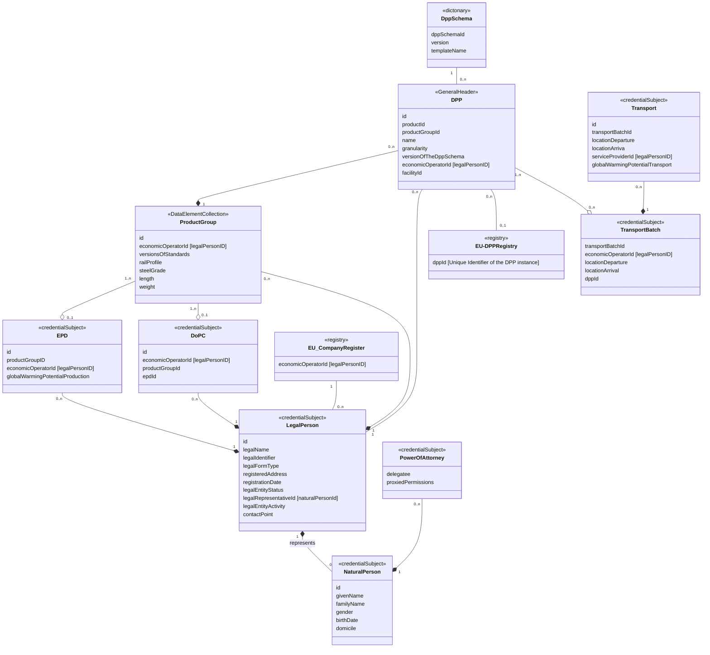

# Credential Vocabulary
# 5. Data Model

# Description data model
This chapter contains describtion of the classes visualized in the diagramm

## Natural Person
A trustworthy issuer E.g. country authority issues an eID to a natural person with attributes described in https://oid.spherity.com/eucc#NaturalPerson according EU Directive 25/2025 https://eur-lex.europa.eu/eli/dir/2025/25/oj/eng/pdf

## Legal Person
A trustworthy issuer E.g. country authority issues an eID (LPID) to a legal person with attributes described in https://oid.spherity.com/eucc#LegalPerson according EU Directive 25/2025 https://eur-lex.europa.eu/eli/dir/2025/25/oj/eng/pdf
A LPID will be issued to a natural person registered as procurist in the commercial registry.

## Power of Attorney
Natural Person with LPID can issue company internally Power of Attorney to employees. Details described in https://oid.spherity.com/poa

## EU Company Registry
Company can be discovered via BRIS Business Register Interconected System https://e-justice.europa.eu/topics/registers-business-insolvency-land/business-registers-search-company-eu_en

## Product Group

## DoPC (Decleration of Product Confirmity)

## EPD (Environmental Product Decleration)

## DPP Schema

## DPP (Digital Product Passport)
class DPP (DigitalProductPassport) is the main entity and represents container for all relevant DPP data. 
dppId: Unique identifier of a Digital Product Passport e.g. URI "uri://www.voestalpine.com/dpp/111.."
productId: Identifies Product e.g. "gtin:111.."
name: e.g. "dppRailUno" 
granularity: Describes production level <model;batch;item>
versionOfTheDppSchema: Describes what schema in what version was used to issue DPP [public, standard]
economicOperatorId: legalPersonId or alternitivly VAT e.g. "vat:ATU14187100"
facilityId: Place of production e.g. GLN number "gln:9110015801378"

## EU-DPP Registry

## TransportBatch

## Transport
DB Cargo needs data to provide transporte service as discribed in class "Transport". Via idProductPassport and via Product Model following data will be provided: 
-  productWeight (via idProductPassport, via idProductModel)
-  productLenght (via idProductPassport, via IdProductModel)
-  Items
Items describes the number of rails that have to be transported.

## DPP Digital Product Passport

### Product ID
unique product identifier means a unique string of characters for the identification of a product that also enables a web link to the digital product passport.

According ESPR Art.2 (30): https://eur-lex.europa.eu/legal-content/EN/TXT/?uri=CELEX%3A32024R1781&qid=1719580391746
| Key            | Value|
|----------------|------|
| Term           |productID|
| URL            |https://github.com/railway-dpp/vocabulary/edit/main/README.md#product-id|
| Expected Value ||

### DPP ID

| Key            | Value|
|----------------|------|
| Term           |dppID|
| URL            |https://github.com/railway-dpp/vocabulary/edit/main/README.md#dpp-id|
| Expected Value ||

### Granulartiy
| Key            | Value|
|----------------|------|
| Term           |granularity|
| URL            |https://github.com/railway-dpp/vocabulary/edit/main/README.md#granulartiy|
| Expected Value ||

### Base DPP Schema Version
| Key            | Value|
|----------------|------|
| Term           |baseDppSchemaVersion|
| URL            |https://github.com/railway-dpp/vocabulary/edit/main/README.md#base-dpp-schema-version|
| Expected Value ||

### Sector Data Model Version
| Key            | Value|
|----------------|------|
| Term           |sectorDataModelVersion|
| URL            |https://github.com/railway-dpp/vocabulary/edit/main/README.md#sector-data-model-version|
| Expected Value ||

### Status of the DPP
| Key            | Value|
|----------------|------|
| Term           |statusOfTheDpp|
| URL            |https://github.com/railway-dpp/vocabulary/edit/main/README.md#status-of-the-dpp|
| Expected Value ||

### Last Update
| Key            | Value|
|----------------|------|
| Term           |lastUpdate|
| URL            |https://github.com/railway-dpp/vocabulary/edit/main/README.md#last-update|
| Expected Value ||

### Economic Operator ID

unique operator identifier’ means a unique string of characters for the identification of an actor involved in a product’s value chain

According ESPR Art.2 (31): https://eur-lex.europa.eu/legal-content/EN/TXT/?uri=CELEX%3A32024R1781&qid=1719580391746

| Key            | Value|
|----------------|------|
| Term           |economicOperatorId|
| URL            |https://github.com/railway-dpp/vocabulary/edit/main/README.md#economic-operator-id|
| Expected Value ||

### Facility ID 
| Key            | Value|
|----------------|------|
| Term           |facilityId|
| URL            |https://github.com/railway-dpp/vocabulary/edit/main/README.md#facility-id|
| Expected Value ||

## Vignol railway rails 46kg/m and above 

### Rail Profil
| Key            | Value|
|----------------|------|
| Term           |railProfil|
| URL            |https://github.com/railway-dpp/vocabulary/edit/main/README.md#rail-profil|
| Expected Value ||

### Steel Grade
| Key            | Value|
|----------------|------|
| Term           |steelGrade|
| URL            |https://github.com/railway-dpp/vocabulary/edit/main/README.md#steel-grade|
| Expected Value ||

### Length
| Key            | Value|
|----------------|------|
| Term           |length|
| URL            |https://github.com/railway-dpp/vocabulary/edit/main/README.md#length|
| Expected Value ||

### Weight
| Key            | Value|
|----------------|------|
| Term           |weight|
| URL            |https://github.com/railway-dpp/vocabulary/edit/main/README.md#weight|
| Expected Value ||

## EPD Environmental Product Declaration

### EPD ID
| Key            | Value|
|----------------|------|
| Term           |epdID|
| URL            |https://github.com/railway-dpp/vocabulary/edit/main/README.md#epd-id|
| Expected Value ||

### Climate Change Effects - Total
| Key            | Value|
|----------------|------|
| Term           |climatChangeEffectTotal|
| URL            |https://github.com/railway-dpp/vocabulary/edit/main/README.md#epd-environmental-product-declaration|
| Expected Value ||

## DOPC Declaration of Product Conformity

### DOPC ID
| Key            | Value|
|----------------|------|
| Term           |dopcId|
| URL            |https://github.com/railway-dpp/vocabulary/edit/main/README.md#dopc-id|
| Expected Value ||

